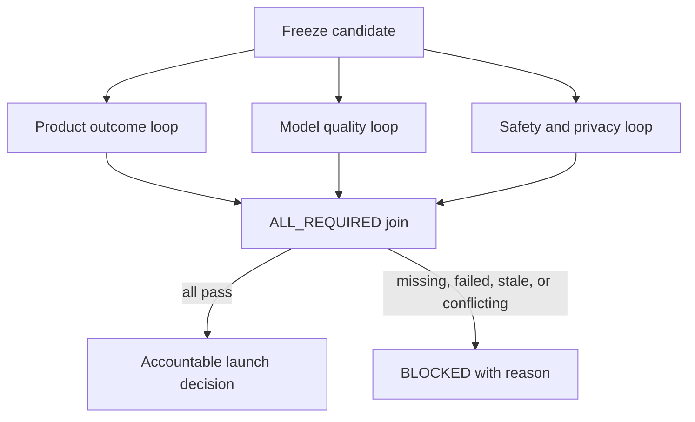

# AI PM Skills Marketplace

**Install focused Claude Code plugins for the product decisions that make AI systems expensive, unreliable, or difficult to ship.**

This repository is the distribution hub for seven installable plugins. Each plugin solves a distinct job, ships examples and validation fixtures, and is designed to produce a useful artifact within one working session.

## Install your first plugin

```bash
claude plugin marketplace add Abhillashjadhav/AI-PM-essential-skills
claude plugin install pm-verifier@ai-pm-skills
```

Then paste a feature spec and ask:

```text
Create an eval for this feature.
```

**AI Evals for PMs**, installed as `pm-verifier`, turns the specification into
a versioned evaluation suite, isolated repeated-trial evidence, outcome,
trajectory, end-to-end system, and optional memory/state grading, calibrated
model judgments, failure analysis, and an auditable release decision.
Its guided customer-support pilot can also bind approved PMOS intent, the eval
contract, Engineering AgentOS, candidate code, and observed evidence without
changing the stable public CLI.

## Choose the job you need done

| Plugin | Use it when you need to… | Ask Claude Code | First useful result |
|---|---|---|---|
| **[AI Evals for PMs](pm-verifier/)** (`pm-verifier`) | Turn a PRD, PMOS contract, traces, or an existing suite into an evidence-backed release decision | `Create a complete eval for this feature` | Portable PMOS/eval/engineering contract chain, versioned four-surface suite, isolated trials, failure inspection, and `PASS`, `FAIL`, or `BLOCKED` evidence |
| **[pm-tactical](pm-tactical/)** | Make daily PM work cheaper, faster, and self-checking | `Check whether this task needs a stronger model` | Model routing, frozen-spec validation, prompt optimization, context audit, or project-memory update |
| **[loop-designer](loop-designer/)** | Convert a recurring task into a bounded autonomous workflow | `Turn this recurring task into a guarded loop` | Loop specification, five guardrails, and Routine plus cron runners |
| **[agent-graph-designer](agent-graph-designer/)** | Connect specialist loops or agents with explicit branches, handoffs, joins, and decision gates | `Design an agent graph for this workflow` | Loop-versus-graph verdict, graph contract, Mermaid topology, and runnable skeleton |
| **[mcp-migration-auditor](mcp-migration-auditor/)** | Check MCP configurations against the 2026 specification changes | `Audit my MCP setup` | Per-server `BREAKS`, `DEGRADED`, or `SAFE` verdicts with cited fixes |
| **[pm-human-writer](pm-human-writer/)** | Preserve a PM's voice while removing recognisable AI-writing patterns | `Rewrite this without flattening my judgment` | Voice-protected rewrite with named edits and evidence constraints |
| **[ai-feature-kill-criteria](ai-feature-kill-criteria/)** | Decide whether an AI feature deserves a prototype | `Define kill criteria for this AI feature` | Falsifiable claim, approved thresholds, cheapest decisive test, owner, and decision date |

Install any plugin with the same two-step pattern:

```bash
claude plugin marketplace add Abhillashjadhav/AI-PM-essential-skills
claude plugin install <plugin-name>@ai-pm-skills
```

## Case study: one AI feature, first a loop, then a graph

A team is preparing an **AI support-ticket summarizer** for launch. The candidate sometimes omits escalation reasons or introduces unsupported customer facts. The team needs to improve one candidate and then decide whether it is safe and useful enough to release.

### Part 1 — Use a loop for nightly candidate improvement

Every night, the loop owns one bounded job: evaluate the current candidate against newly labelled tickets and the frozen regression set, then produce either a verified improvement package or a visible blocked report.

```text
DISCOVER  — collect new labelled tickets, deduplicate them against the seen log,
            and run the frozen regression set
PLAN      — group failures by factuality, completeness, and escalation reason
EXECUTE   — create one bounded prompt, retrieval, or configuration change in
            an isolated candidate package
VERIFY    — an independent verifier reruns the same evaluation and regression gates
STOP      — keep the current candidate if no verified improvement exists;
            otherwise output the improved candidate for review. Retry once at
            most, then return BLOCKED with the remaining failures
```

Loop guardrails cap attempts, time, and cost; preserve the frozen evaluation set and cross-run seen log; prohibit deployment; and report successful, empty, failed, and guardrail-tripped runs.

**Why a loop:** the same objective and sequence repeat every night against one candidate. There is one working context and one stop condition; parallel branches or a join would add coordination cost without improving this task.

### Part 2 — Use a graph to decide whether the candidate can launch

Passing the model-quality loop is necessary but not sufficient for launch. Freeze the passing candidate, then coordinate three independently verifiable review loops:



- **Product outcome loop:** verifies that summaries help support agents make the correct next decision.
- **Model quality loop:** verifies factuality, completeness, and required escalation reasons.
- **Safety and privacy loop:** verifies restricted-data and unsafe-output gates.
- **Join:** admits only schema-valid evidence for the same candidate; every required branch must pass.
- **Decision gate:** presents the evidence to the accountable owner and performs no deployment itself.

**Why a graph:** the launch decision depends on different evidence, owners, permissions, and failure paths that can run independently but must converge. Each node can be a guarded loop; the graph owns their coordination.

**Decision boundary:** use a loop to improve one bounded unit of work. Use a graph when the outcome depends on coordinating multiple bounded units.

## See the outputs before installing

### Spec → verification system

AI Evals for PMs separates binary, disqualifying failures from gradual quality criteria:

```text
PRODUCT CONTRACT: AI support workflow

SURFACES
- outcome: correct resolution reaches the user
- trajectory: correct policy and risk-critical path
- system: intake → identity → policy → decision → delivery
- memory: only if promised; write → retrieve → update → forget + isolation

RELEASE GATES
1. No fabricated customer facts — automatic failure
2. Required escalation reason present — automatic failure
3. No restricted personal data in output — automatic failure

JUDGE RUBRIC
- factual completeness: anchored 1–5
- actionability: anchored 1–5
- concise communication: anchored 1–5

HARNESS
execute → grade → inspect → report

EVIDENCE
repeated four-surface trials + PMOS/eval/engineering digest chain + operations
→ PASS, FAIL, or BLOCKED
```

See the complete workflow in [AI Evals for PMs](pm-verifier/), installed and
run through the stable `pm-verifier` identifier.

### Recurring task → guarded loop

`loop-designer` makes the safety structure explicit before generating a scheduler:

```text
Discover → Plan and deduplicate → Execute → Independent Verify → Stop or Repeat

Required guardrails:
- iteration cap
- cost ceiling
- cross-run seen log
- destructive-action allowlist
- completion and failure notification
```

See the worked example in [`loop-designer`](loop-designer/).

### Multiple loops → governed agent graph

`agent-graph-designer` rejects unnecessary graph complexity, then makes coordination explicit when a graph is justified:

```text
QUALIFY → GRAPH_REQUIRED

Freeze candidate
  ├─ Product-outcome review loop ─┐
  ├─ Model-quality review loop ───┼─ ALL_REQUIRED join → Human decision
  └─ Safety/privacy review loop ──┘

Every node: typed input/output + tools + permissions + budget + verifier
Every edge: condition + evidence + state mapping + failure destination
```

See the executable synthetic example in [`agent-graph-designer`](agent-graph-designer/).

### MCP config → migration decision

`mcp-migration-auditor` converts configuration evidence into a prioritized action table:

```text
| Server | Status   | Reason                | Required action |
|--------|----------|-----------------------|-----------------|
| api    | BREAKS   | session dependency    | migrate state   |
| local  | SAFE     | stdio unaffected      | none            |
```

See the sample audit in [`mcp-migration-auditor`](mcp-migration-auditor/).

## Product principles

- **One plugin, one decision job.** Installation should not require learning an operating system.
- **Outputs over prompt collections.** Each plugin produces a concrete artifact a PM or team can inspect and use.
- **Verification before confidence.** Claims are bounded by tests, fixtures, official sources, or explicit limitations.
- **Human judgment remains accountable.** The plugins structure decisions; they do not own product responsibility.
- **No silent success.** Missing evidence, incompatible inputs, and unverifiable outcomes must remain visible.

## Marketplace structure

| Path | Purpose |
|---|---|
| [`.claude-plugin/marketplace.json`](.claude-plugin/marketplace.json) | Installable marketplace catalogue |
| [`pm-verifier/`](pm-verifier/) | AI Evals for PMs: spec-to-evidence-backed-release-decision plugin and CI harness |
| [`pm-tactical/`](pm-tactical/) | Daily AI PM workflow plugin |
| [`loop-designer/`](loop-designer/) | Guarded-loop design plugin |
| [`agent-graph-designer/`](agent-graph-designer/) | Multi-agent graph qualification and design plugin |
| [`mcp-migration-auditor/`](mcp-migration-auditor/) | MCP compatibility and migration plugin |
| [`pm-human-writer/`](pm-human-writer/) | Voice-preserving product-writing plugin |
| [`ai-feature-kill-criteria/`](ai-feature-kill-criteria/) | Pre-build AI feature decision-contract plugin |
| [`tests/`](tests/) | Manifest, trigger, policy, and known-answer fixtures |

## Additional tools in this repository

These remain available but are not the seven marketplace products above:

- [`token-cost-estimator/`](token-cost-estimator/) — compare projected model cost and latency; verify current prices from official sources.
- [`context-auditor/`](context-auditor/) — identify poisoning, distraction, and conflicting supplied context.
- [`concise-rewriter/`](concise-rewriter/) — reduce supplied text and report token change.
- [`context-port/`](context-port/) — separate local-first context-package validation and migration toolkit.

The retired [`eval-rubric-generator/`](eval-rubric-generator/) path contains
migration guidance only. It is not a triggerable skill; rubric creation now
belongs to `pm-verifier`.

Keeping these boundaries explicit prevents older utilities from competing with the marketplace’s current products.

## Verify the repository

```bash
python3 scripts/check_repository_integrity.py
python3 -m unittest discover -s context-port/tests -q
```

The public-smoke workflow verifies the marketplace manifest, plugin layout, repository links, additional standalone skills, and ContextPort’s deterministic quickstart from a clean checkout.

What this does **not** certify:

- behavioural quality across every live model and environment;
- current provider pricing or model availability;
- compatibility with every Claude Code or MCP release;
- product outcomes without human review of the generated artifacts.

## Contributing

Keep each contribution inside one product boundary. New marketplace plugins must solve a distinct decision job, declare their input/output contract, include fire and no-fire fixtures, provide a known-answer example, and state evidence limitations. Avoid adding generic prompt collections that duplicate an existing plugin.

## License

[MIT License](LICENSE).
