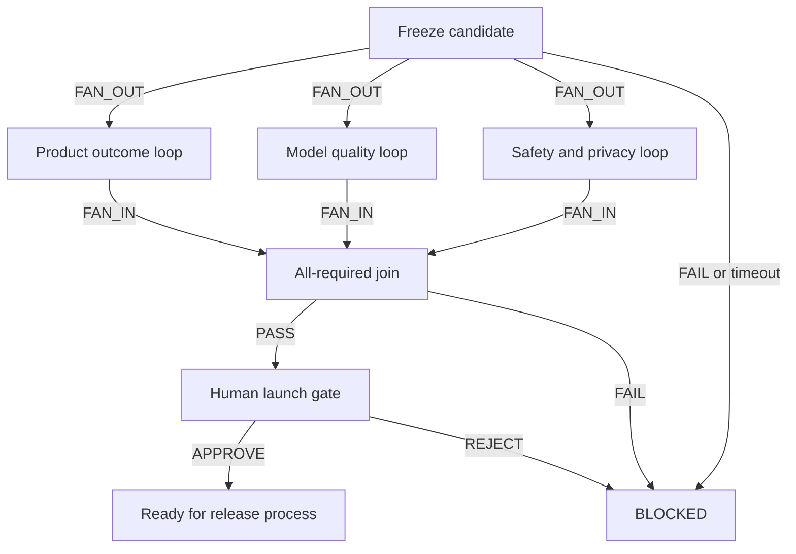

# Sample graph package

## Graph decision

```text
Verdict: GRAPH_REQUIRED
Problem: launch evidence is fragmented across three independently verifiable domains.
Hypothesis: parallel specialist review loops with typed artifacts and an all-required join reduce decision time without weakening accountability.
Outcome North Star: percentage of evaluated release candidates that receive a correct, evidence-backed launch decision within two working days.
Leading metrics: valid branch-artifact rate; review completion time; join-block rate; repair rate.
Guardrails: no fabricated evidence; synthetic data only; verifier independence; no autonomous deployment.
Key trade-off: lower wall-clock time versus higher orchestration and token cost.
Proposed next step: run one synthetic candidate and stop at a human approval gate.
Qualification evidence: three branches can run independently, require distinct evidence and verification, and must converge before the decision.
```

## Topology



## Machine-readable contract

The source of truth is [`sample-graph-contract.json`](sample-graph-contract.json). It declares:

- eight bounded nodes;
- typed fan-out, retry, fan-in, failure, approval, and rejection edges;
- versioned state ownership;
- an `ALL_REQUIRED` join;
- maximum two attempts per specialist loop;
- whole-graph cost and concurrency ceilings;
- a human gate before any release process.

## Runnable skeleton

[`sample-orchestrator.py`](sample-orchestrator.py) loads the contract, freezes one synthetic candidate digest, executes the three review loops concurrently, validates their schemas and digests at the join, and stops at `AWAITING_HUMAN_APPROVAL`.

It performs no model, network, deployment, merge, send, publish, purchase, delete, or overwrite action.

## Independent verification

```text
GRAPH_CONTRACT_VALID
PASS exactly one start node is declared
PASS all edge endpoints reference declared nodes
PASS all non-terminal nodes have visible exits
PASS both terminal nodes are reachable
PASS all three fan-out branches converge at one ALL_REQUIRED join
PASS join validates presence, schema, candidate digest, and branch status
PASS every retry cycle is bounded to two attempts
PASS candidate-freeze, exhausted-review, timeout, and join failures terminate BLOCKED with a reason
PASS whole-graph and per-node budgets are bounded
PASS tools and writes are allowlisted per node
PASS reviewers cannot approve launch
PASS launch waits at a named human approval gate
PASS runner stops with no external actions taken
```

## Limitations

- Synthetic branch results demonstrate orchestration shape, not live-model quality.
- The runner does not integrate with product analytics, evaluation platforms, policy engines, or deployment systems.
- A production implementation still requires verified APIs, identity, permissions, durable state, monitoring, and incident controls.
