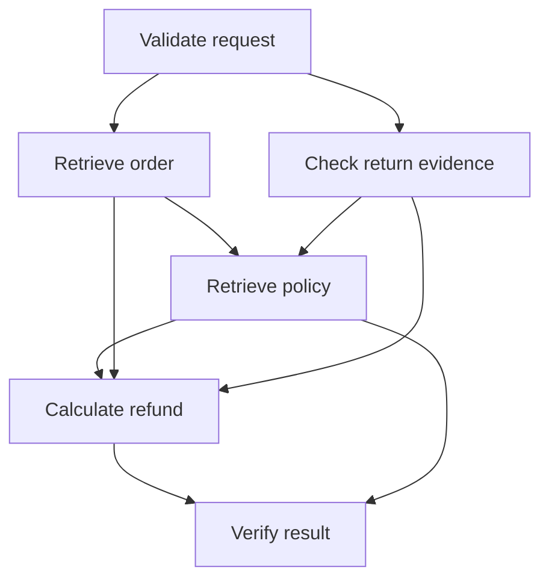

# Graph Engineering: test a different choice halfway through

A runnable, inspectable example for the question: **What would your AI have done if it had made a different choice halfway through?**

This example demonstrates checkpointing and forking with six distinct scripted workers. It makes no live LLM calls. The customer, order, inspection and policies are fictional.

## Run it

Python 3.10+ and the standard library are enough for the runner and checks:

```sh
python3 verify_demo.py
```

This executes the baseline and two forks in separate Python processes. The baseline saves a checkpoint to disk before continuing. A later process reads that checkpoint to create each fork. Twenty-five checks validate the resulting artifacts and guard conditions.

The default `evidence` folder must not already exist. To reproduce alongside the recorded evidence shipped here:

```sh
python3 verify_demo.py --out evidence-reproduced
```

To inspect individual commands:

```sh
python3 fork_graph.py baseline --out my-run
python3 fork_graph.py fork --checkpoint my-run/checkpoint-C1.json --strategy effective_date --out my-run/fork.json
```

## What happens

A fictional customer paid INR 2,400 for headphones confirmed damaged on arrival. The fixed policy dataset contains an expired policy with a 20% restocking fee and a current policy that exempts arrival damage.

The original text-overlap retrieval chooses the expired policy and calculates a INR 1,920 proposal. An independent rule check blocks that proposal. The fork starts from checkpoint C1 and changes only `config.retrieval_strategy` from `text_match` to `effective_date`. It retrieves the currently applicable policy, calculates INR 2,400, and passes the same independent check. No refund is sent.

A third run keeps the original choice as a control and reproduces the original blocked result. The original checkpoint and execution file remain byte-for-byte unchanged.

## Six different tasks



C1 is saved after request, order, and return evidence are admitted, before policy retrieval. The fork resumes the policy, calculation, and verification tasks. Each has a different purpose; this is not several agents doing the same job to obtain redundant answers.

`graph-contract.json` records the task contracts and controls and is cross-checked with the runner dependencies. Node-level admission and the independent final rule check serve different purposes: admitting a selected source does not assert it is the applicable policy.

## Evidence

- `evidence/checkpoint-C1.json`: immutable saved state with source, implementation, fixture and artifact hashes.
- `evidence/original.json`: original policy choice, INR 1,920 proposal, failed applicability and amount checks.
- `evidence/fork-effective_date.json`: changed retrieval choice, selected current policy, INR 2,400 verified proposal.
- `evidence/fork-unchanged-control.json`: unchanged-choice control.
- `evidence/required-task-failure.json`: bounded required-task failure blocks completion.
- `evidence/demo-evidence.json`: 25 checks and the complete comparison used to render the video.
- `evidence/subprocess-transcripts.json`: recorded commands and emitted execution events.

The worker fixture excludes the separate, explicitly specified evaluation oracle. The final verifier independently reads the applicable source rule instead of accepting the selected policy as ground truth. The evaluation also compares the final amount to the oracle fixed before execution.

## Render the terminal video

Install Pillow in your local environment and ensure FFmpeg is on PATH. The renderer uses DejaVu Sans and DejaVu Sans Mono from `/usr/share/fonts/truetype/dejavu`; adjust `FONT_ROOT` if needed.

```sh
python3 render_video.py --preview-only
python3 render_video.py
```

The video is a 54-second, 1080 x 1350 silent replay of the recorded execution, with reading pauses. Its terminal style follows the earlier graph/loop videos. The labels explicitly disclose the synthetic case, scripted workers and absence of model calls. It is not an unedited screen capture.

## Scope of the claim

Checkpoint-and-fork support is implemented explicitly here. It is not an automatic guarantee of every graph, nor is it exclusive to graphs: an instrumented loop can also expose state, tracing and replay boundaries. Downstream tasks rerun after the checkpoint.

The fixed deterministic fixture makes this comparison repeatable. Real LLM or live-tool experiments would need additional controls for changing data and nondeterminism, plus broader evaluations. One passing example does not establish general reliability, cost savings, production readiness or causality in an uncontrolled live system. The local runner uses a cooperative overall deadline, not preemptive per-task timeouts. Hashes detect mismatches; they are not adversarial security controls.

## References

- Graph Engineering design skill: https://github.com/Abhillashjadhav/AI-PM-essential-skills/tree/main/agent-graph-designer
- LangGraph checkpoint replay and forking: https://docs.langchain.com/oss/python/langgraph/use-time-travel
- Agent loops can also preserve and resume state: https://openai.github.io/openai-agents-python/running_agents/
