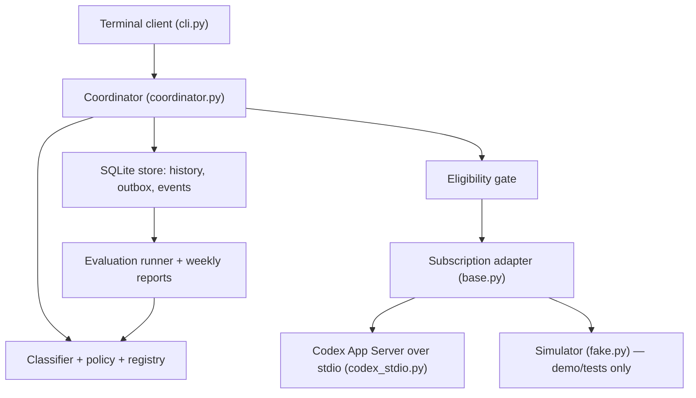

# Architecture

The router core never sees Codex wire formats. It only uses the typed contracts in `contracts.py` and the adapter interface in `adapters/base.py`.

## Components

| Module | Responsibility |
|---|---|
| `contracts.py` | Versioned dataclasses and enums, validation, the job state machine and its transition guards |
| `classifier.py` | Deterministic local rules. Quoted text and attachments are treated as data. Returns reason codes and uncertainty, never a confidence score |
| `policy.py` | Minimum role per task type, the upward fallback, and the section 5.3 implementation-role rule |
| `registry.py` | Discovered candidates, approved role mappings bound to hashes, atomic revisions |
| `capacity.py` | SUFFICIENT, TIGHT or UNKNOWN from a validated calibration artifact. UNKNOWN by default |
| `eligibility.py` | Fresh auth, account, usage, spend, model and tool checks before every dispatch |
| `handoff.py` | Architecture record, owner-acceptance detection, clarity and risk evidence, hashed package, context budget |
| `coordinator.py` | Routing with a timeout fence, pins, overrides, outbox dispatch, streaming, checkpoints, queue, recovery, handoff |
| `store.py` | SQLite (WAL) storage, migrations with backups, blobs checked by sha256, events, leases, compare-and-swap job transitions |
| `adapters/codex_stdio.py` | JSON Lines JSON-RPC client, pin and drift checks, minimal environment, event translation, spend decision |
| `adapters/fake.py` | In-process simulator. Everything it returns is marked `synthetic` |
| `attachments.py`, `webfetch.py` | Local TXT, MD, DOCX and PDF extraction, and fetching of public pages you named |
| `evals/*`, `reporting.py` | Graders, judge self-check, offline runner, gated live plans, weekly metrics, redacted exports |

## Life of a message

1. **Intake.** The message, attachment manifest and job are saved in one transaction as DRAFT, then ROUTING. The route attempt ID fences the job.
2. **Route.** Classification and policy run in a worker thread with a 4-second deadline, measured from submission. If the result arrives in time, one transaction saves the assessment, the route decision (with timings), the thread pin, the pin history and the move to SELECTED. On timeout, the job moves to AWAITING_MANUAL_MODEL. A late result can't commit, because the compare-and-swap check requires ROUTING and the same attempt ID. The router logs `route.late_result_discarded`.
3. **Run.** The router takes the single dispatch lease, then the eligibility gate re-reads account, usage, spend, models and tools. If any check fails, the job moves to BLOCKED_AUTH, BLOCKED_SPEND, BLOCKED_CAPABILITY or WAITING_USAGE, and the real blocker is shown.
4. **Outbox.** The router saves a PREPARED dispatch and moves READY to DISPATCHING. It creates the provider thread in two stages (a CREATING mark first) or resumes it, checking that the provider's model equals the pin. It marks the dispatch SENT **before** writing `turn/start`, and ACKNOWLEDGED with the provider turn ID as soon as that arrives.
5. **Stream.** Deltas go into the answer message in batches (every 250 ms or 2,000 characters). Warnings are logged, not treated as failures. A fatal error beats a later `turn/completed`. A usage-limit error writes a checkpoint and moves the job to PAUSED. A reroute is recorded, interrupted and kept as partial.
6. **Recovery.** A PREPARED dispatch that was never sent resumes on the same pin. For SENT, UNCERTAIN or ACKNOWLEDGED, the router reads the provider thread and matches it by turn ID or `clientUserMessageId`. With no match, the job goes to RECOVERY_REQUIRED and the router asks you to choose `resend` or `drop`. It never resends on its own.

## Job states

`DRAFT → ROUTING → SELECTED | AWAITING_MANUAL_MODEL`. A job leaves `AWAITING_MANUAL_MODEL` only through a manual choice. `SELECTED`, `PAUSED` and the waiting states pass through eligibility to reach `READY`. Only `READY` can move to `DISPATCHING`. An uncertain dispatch goes to `RECOVERY_REQUIRED`, never to `READY`, unless you confirm it didn't execute. `SUCCEEDED`, `FAILED` and `CANCELLED` are terminal. Job state, provider turn status and your task outcome are stored separately.

## Idempotency and concurrency

- `jobs.logical_key` is unique: a request ID, or `handoff:<id>`.
- `handoffs(source_thread_id, architecture_version)` is unique, so one architecture version gives at most one implementation thread.
- `architecture_records(thread_id, record_hash)` is unique.
- A partial unique index allows only one open dispatch per job.
- The `dispatch` lease allows one model turn at a time. A lease held by a dead process is stale.

## Architecture handoff

`finalise_architecture` runs when your message matches an explicit acceptance pattern ("Approved, implement this") or when you use `/finalise`. It:

- validates the structured record (all sections, no blocking questions, no open decisions);
- checks which project the record belongs to;
- versions the record by content hash;
- assesses clarity (evidence only) and risk;
- estimates capacity and applies section 5.3;
- builds the full package (prose, record, decisions, constraints, tests, repository identity, attachments, acceptance) with a sha256 hash, and checks it against the context budget;
- creates, in **one** transaction, the handoff row, the implementation thread in the same project, the route decision, the pin, the first input message and the job.

The provider thread is created later, when the gates allow it. The architecture thread itself is never changed.
