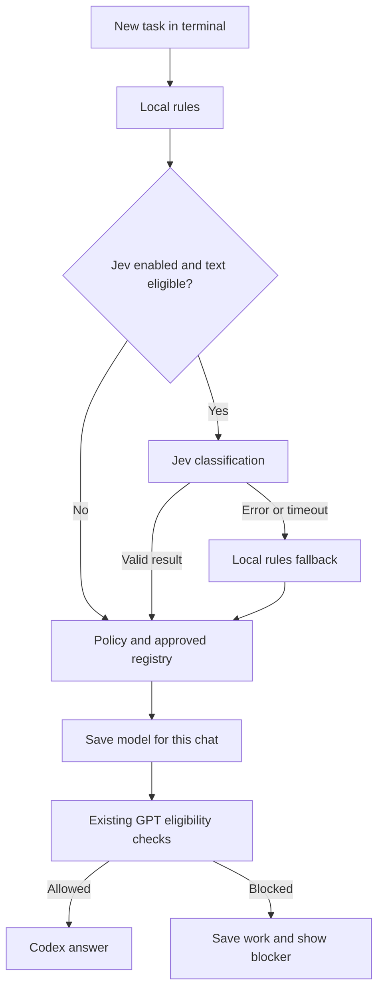

# TypeSafe Jev integration — architecture and operating guide

Status on 2026-09-27: implemented and verified offline. Draft runtime PR [#71](https://github.com/Abhillashjadhav/AI-PM-essential-skills/pull/71). Not activated on the owner's Mac; no live Jev or GPT call has been made for this change. Nothing is merged into `main`.

## Goal and agreed experience

Choose a suitable GPT reasoning tier automatically from the first task in each new router chat, keeping the user's choices and risk rules in control. Jev supplies a structured classification; it does not write the answer or choose an arbitrary executable GPT model ID. The approved registry supplies the actual GPT model and reasoning setting.

The router, history, routing policy, audit records and interface run on the Mac. Jev runs on TypeSafe's servers. GPT runs on OpenAI's servers through the existing Codex subscription adapter. This is local orchestration, not offline model inference. No Kev, Qwen or CLM weights are needed for this integration.

The owner explicitly chose **provider-enforced TypeSafe credits**. There is no local dollar cap, request quota, estimated-balance cutoff, expiry timer or daily billing confirmation. The TypeSafe API key is needed even when the account uses free credits. It is unrelated to an OpenAI API key.

## Interfaces and their limits

| Surface | What is available | What is not established |
|---|---|---|
| Mac terminal | Run the existing router chat with Jev enabled | Live performance and account behavior still need the local pilot |
| Desktop app's integrated terminal | Run the same commands inside the desktop app; optionally add a reusable action in app settings | This does not intercept the normal Codex chat composer or populate its native thread list |
| Existing ChatGPT browser tab | No automatic-router adapter shipped | No documented pre-send interception/model-picker control was found in the public plugin UI bridge |

Official OpenAI documentation describes the [integrated terminal](https://learn.chatgpt.com/docs/integrated-terminal) and [local environment actions](https://learn.chatgpt.com/docs/environments/local-environment). Those support running commands within the app. Their availability on the owner's installed app version is not yet observed.

The [public plugin UI bridge](https://developers.openai.com/plugins/reference) documents tool calls, messages, files and UI state; it does not document changing the host conversation's model. **Inference:** a widget/tool integration alone does not establish the requested automatic, before-first-message routing in the native browser composer. An extension that clicks page controls would need a separately validated design and could break when the page changes. No browser automation, private endpoint or cookie access was added.

## End-to-end flow



1. Save the user's prompt, task and routing attempt in the existing SQLite transaction.
2. Run the existing local classifier. If Jev was explicitly enabled, ask Jev for the task category and an independent assessment of consequences in one HTTPS request.
3. Validate the exact Jev version, response structure, category, probabilities, confidence and token-usage fields. A changed version is not automatically approved.
4. Combine with local rules. Recognized risk floors cannot be lowered. Jev may raise a category or resolve an unknown; quoted/unseen content retains the existing safeguards. A resolved unknown is removed from secondary categories so it no longer incorrectly forces the highest tier.
5. Apply the existing policy, approved registry and capability requirements. Persist the chosen model before GPT work starts.
6. The existing GPT eligibility gate still checks sign-in, subscription usage, spend eligibility, model availability and tools. TypeSafe access does not satisfy any of these GPT checks.
7. Follow-up messages reuse the thread's model. A human override is recorded. Jev is not called for normal follow-ups or `/newtask` bookkeeping.

## Routing contract retained

| Work | Minimum tier |
|---|---|
| Architecture, product/UI decisions, difficult trade-offs | Highest |
| Résumés and applications, LinkedIn writing, research articles, consequential assessment | Highest |
| Code affecting money movement, privacy, security or destructive/risky production behavior | Highest |
| Ordinary implementation of an agreed design | Middle |
| Routine notes, formatting, low-consequence summaries and literal resource extraction | Lowest |
| Unclear classification | Conservative upward choice |

The latest model is not automatically the best model. The registry discovers candidates; comparison on real tasks and owner approval precede promotion. Existing chats keep their pinned model after a registry change.

Architecture approval creates a separate implementation thread in the same router project. The handoff includes the structured architecture, decisions, constraints, scope, files, tests and acceptance evidence. The model in the architecture thread remains unchanged. The existing capacity-based implementation downgrade is retained: it requires proven clarity, low risk, a capable approved lower model, and a validated TIGHT-capacity estimate. Jev does not override that gate.

The retired weighted priority/usage formula is not reinstated. User priority, consequences, usage eligibility and implementation-capacity policy remain separate inputs.

## TypeSafe protocol and local controls

| Item | Implementation |
|---|---|
| Endpoint | `POST https://api.typesafe.ai/v1/systemone` with a private bearer key |
| Model | `jev-1.13.0`, pinned; no moving alias |
| Question 1 | `choice` over the 11 existing `TaskKind` values |
| Question 2 | `noul` assessing consequential work, without depending on question 1 |
| Confidence | Provisional 0.80 minimum for both reported confidence and chosen probability; ordinary categories also require consequence probability at most 0.20 |
| Uncertainty | Return unknown, then apply the existing conservative policy; these thresholds do not certify 95% accuracy |
| Input | First task text only, at most 16,000 UTF-8 bytes; oversized text uses rules without truncation |
| Attachments/context | No attachments, files or histories uploaded to Jev. If a task has attachment context, use local rules for that task |
| HTTP deadline | Disposable subprocess, total 1.6 seconds including startup/DNS/TLS/read; parent kills it on timeout |
| Overall route | Existing four-second timeout and manual-choice path remain; a late result cannot commit |
| Transport | Fixed HTTPS origin, no redirects or ambient proxies, 64 KiB maximum response, no SDK retries |
| Errors | Invalid result or any provider/transport failure stops further Jev sends until local reactivation; rules keep working |
| Manual off | `python3 model-router/router.py jev disable` |
| Simulation | No Jev call or external plugin import in `--simulate`; offline evaluations remain offline |

The 1.6-second deadline is implemented and tested with a deliberately stalled process. Live Jev success rate within that deadline and complete routing latency on the Mac remain **UNKNOWN**. Model answer-generation time is outside the routing deadline, as agreed.

## Who enforces the free credits?

TypeSafe does. Its [customer agreement, section 8.2](https://typesafe.ai/legal/mca) describes promotional credits and optional automatic refills; without refill opt-in it may refuse output once credits are gone. This supports the selected operating arrangement but is not evidence of an exact, observed $5 atomic cutoff on this account. We have not deliberately exhausted the account to test that boundary.

Setup asks the owner to confirm that only free credits are available, auto-recharge is off, and no payment method is saved. It does not change those settings, purchase anything, or ask for a local budget. Billing changes and other clients' spending are not monitored. The reviewed [API reference](https://docs.typesafe.ai/api) exposes request token usage, not an account credit balance; no balance endpoint is invented.

The router stops on any unsuccessful provider response, so it does not rely on a guessed billing-specific error code. It does not automatically try again. If free credits become available again, run `jev setup` to reactivate intentionally.

Successful request tokens and an estimated cost at the published rate are logged for visibility only. The estimate is not a bill, is not a remaining balance, excludes uncertain/failed request charges, and never blocks or authorizes spending. Price changes can make it stale.

## Local records and recovery

Under the router's existing private data directory:

- `jev/api-key`: owner-only permissions, plain text protected by OS filesystem access. Never placed in Git, argv, prompts, logs or the Codex child environment.
- `jev/state.json`: enabled state, key fingerprint, pinned protocol/model version, aggregate usage and the in-flight request reference.
- `jev/requests/<request-hash>.json`: one bounded record per attempted classification, with prompt hash, state, version, typed result, probabilities, usage and elapsed time. No task text is copied into these records. A hash is not anonymisation.
- `jev/client.lock`: non-blocking cross-process lock. If another request is active, use rules immediately.

Records remain until the owner deletes them. Writes are atomic and fsync both file and directory before network dispatch. Request lookup uses its own file rather than scanning all historical requests.

For a recovered routing request, use its saved result when available. An uncertain request is never resent, including after reactivation. A missing recovery result uses local rules without a new remote call. The original GPT outbox, lease and recovery protections remain unchanged.

## Activate and test on the Mac

From the local repository, check out the full documentation branch after saving any existing local work. Do not discard changes or merge main.

```bash
git fetch origin docs/model-router-jev-guide
git switch --track origin/docs/model-router-jev-guide
```

If that branch already exists locally, use `git switch docs/model-router-jev-guide` and `git pull --ff-only` instead. If the clone uses a single-branch fetch specification, use `git fetch origin docs/model-router-jev-guide:refs/remotes/origin/docs/model-router-jev-guide` before switching.

Open the desktop app's terminal for this repository, or the Mac terminal. Then:

```bash
python3 -m unittest discover -s model-router/tests -q
python3 model-router/router.py jev setup
python3 model-router/router.py jev pilot
python3 model-router/router.py jev status
```

`jev setup` is interactive. Enter the key only into the hidden local terminal prompt, never into a Codex/ChatGPT message. No live request happens during setup. No installation of a Python package or model weights is needed.

`jev pilot` makes at most six live Jev calls using public synthetic examples and records rules-only vs combined tiers and elapsed time. It starts no Codex server, makes no GPT calls, and cannot wake queued work. A six-example success is a connectivity/safety smoke result, not the 95% real-use goal.

For normal GPT work, retain the original account setup and doctor:

```bash
python3 model-router/router.py setup
python3 model-router/router.py doctor
python3 model-router/router.py project add --name MyProject --path /absolute/path/to/project
python3 model-router/router.py chat --project MyProject
```

If `MODEL_ROUTER_CLASSIFIER` is already set, that explicit plugin takes precedence over the built-in Jev integration. Remove that setting in the launching terminal to use Jev. Use the same `--data-dir` for Jev setup and router chat if overriding the default.

The original GPT spend gate may still report BLOCKED/UNKNOWN, particularly on a personal plan. Report that exact result; do not bypass it or buy another plan. Jev-only testing is still available independently. The router does not automatically start in response to opening the desktop app or typing into its normal chat box.

For a desktop shortcut, use the app's local-environment action UI to run `python3 model-router/router.py chat --project MyProject`. No undocumented environment-file schema or app settings were written by this cloud session.

## Verification and next evaluation

- **VERIFIED offline:** 252 router tests, including 30 Jev-specific tests; repository required checks and integrity; 107 ContextPort tests; simulator demo and its 33 scripted acceptance checks.
- **VERIFIED negative control:** old plugin selected highest after resolving routine/implementation unknowns; patched code selects lowest/middle with recognized secondary risks retained.
- **NOT RUN live:** Jev authentication/protocol, real classification accuracy, network latency, Mac memory/response, and GPT execution.
- **NOT IMPLEMENTED:** native browser/Codex composer interception or a new dashboard. Existing weekly reports and local records remain available.

After the smoke pilot, use an owner-approved set of real tasks to compare rules and Jev, recording wrong downgrades separately from conservative upgrades. Preserve the agreed weekly measure: threads where the owner changes the selected model divided by eligible new threads, target at most 5%. Task resolution and changed-task overrides remain separate measurements. Review within the existing 30-minute weekly budget; no automatic model promotion or claim of 95% suitability follows from the synthetic tests.

Sources checked on 2026-09-27: [TypeSafe API](https://docs.typesafe.ai/api), [models](https://docs.typesafe.ai/models), [intent routing](https://docs.typesafe.ai/patterns/intent-routing), [credit terms](https://typesafe.ai/legal/mca), [Codex App Server](https://learn.chatgpt.com/docs/app-server), [integrated terminal](https://learn.chatgpt.com/docs/integrated-terminal), [local actions](https://learn.chatgpt.com/docs/environments/local-environment), [plugin UI reference](https://developers.openai.com/plugins/reference).
